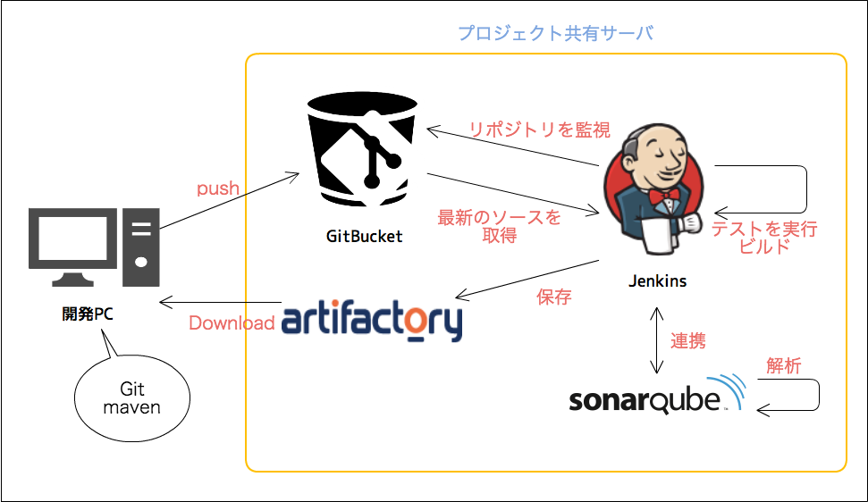

======================
ソースコード管理の流れ
======================

PG・UT中のソースコード管理の流れを以下に記載します。

開発概要
========

使用ツール
----------------------

- バージョン管理：Git / GitBucket
- ビルドツール：maven
- ライブラリ管理：Artifactory
- CI：Jenkins
- ソースコードの品質監視：SonarQube

各ツールの説明
----------------------

- GitBucket：Gitのリポジトリサーバ。ソースコード管理、ソースコードレビュー、ソースコードのマージに利用。
- Artifactory：リポジトリ管理システム。PJ用のmavenリポジトリとして利用。基盤ライブラリなどを管理する。
- Jenkins：CIサーバ。継続的にテストや静的解析を実施し、品質を確保する。また、リリース用の成果物の作成や、リポジトリ管理システムへのライブラリの公開なども行う。
- SonarQube：ソースコード品質管理システム。ソースコードに対する静的解析や、ユニットテストのカバレッジなどからソースコードの品質をメトリクスによって可視化する。

開発フロー
----------------------

1. 開発者は最新のソースコードをGitBucketから取得する。
2. mavenを使用して、プロジェクトが依存するライブラリをArtifactoryから取得し、依存関係を解決する。
3. プログラムを修正し、gitにてバージョン管理(commit)する。
4. 修正したプログラムをGitBucketにpushする。
5. JenkinsはGitBucketから最新のソースコードを取得し、アプリケーションが常に動作する状態か監視する。
6. JenkinsとSonarQubeは連携されており、ソースコードの品質を常に監視する。
7. Jenkinsは、各リポジトリのソースをライブラリ(jar)としてArtifactoryに格納する。

Gitについて
===========

| Gitの使用方法を以下ドキュメントに記載します。
| コミットコメントやレビュー方法についても記載しているので、目を通してください。
|

* :doc:`Git/index`
