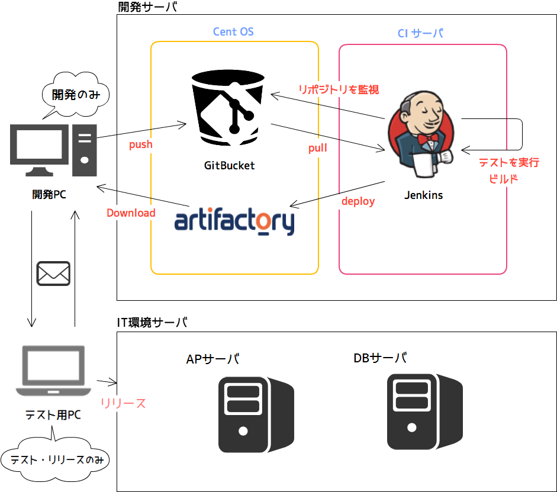
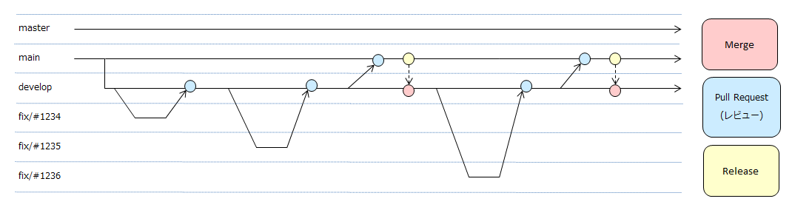

=====================================
結合テスト工程のリリースについて
=====================================

.. contents:: 目次
    :depth: 2

記載内容
=========

結合テスト環境でのリリースの流れと手順です。

既存のリリース手順はなく、リリースに対しての品質を担保できれば問題ない、という環境に対してのリリース方法を記載しています。

前提
======

結合テスト時の全体構成
-----------------------

| 今回、メンバーは2拠点にて開発・テストを実施する。
| ただし、ソースコードの修正は開発用サーバ上にて管理し、各環境に対してはリリースおよび打鍵テストのみ行う。
| それによって、拠点間・環境間で、ソースコードの整合性がとれない問題は発生しない。

各ツールの説明
--------------

| **★gitBucket**
|
| ソースコードのバージョン管理を行っているツール。
| 前回リリースしたソースコードと今回リリースするソースコードの差分を確認することが出来る。
|
| **★Jenkins**
|
| 継続的インテグレーションツール。
| バージョン管理されたソースコードの最新断面を取得して、コンパイル・テストを実行する。
| コンパイルエラーが発生しないこと・自動テストが失敗しないことを確認することが出来る。
| また、Jenkinsから各リリースバージョンのjarファイル/warファイル/earファイルを作成することが出来る。
| jarファイル/warファイルは自動的にArtifactry（後述）に配置され、バージョン管理される。
|
| **★Artifactory**
|
| ライブラリを管理するツール。
| リリースするjarファイル/warファイルを管理する。
| 開発者は各モジュールのファイルをダウンロードして、開発環境へのライブラリ管理の依存関係として使用することが出来る。
| ライブラリアンはリリースする資源としてArtifactory上のjarファイル/warファイルをダウンロードすることが出来る。
| また、結合テスト環境にリリースするearファイルもArtifactoryからwarをダウンロードして作成する。
|

ブランチ
-----------

ソースコードを管理するgitブランチは以下のように運用する。なお、各ブランチの役割は以下の通り。

- masterブランチ ... 本番リリース用のブランチ。基本的には本ブランチはIT工程にて使用しない。
- mainブランチ ... 結合テスト環境リリース用のブランチ。本ブランチにて開発者が結合テスト環境へリリースするための最終確認を行い、結合テスト環境へ資源をリリースする。
- developブランチ ... 開発用ブランチ。本ブランチにてリリース前開発者がUTレベルの打鍵テストを行う。なお、レビュー済みのソースコードのみ格納されているブランチである。
- fixブランチ ... 不具合・仕様変更対応を行うブランチ。対応完了後はdevelopブランチへマージされる。

